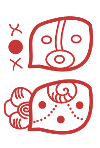
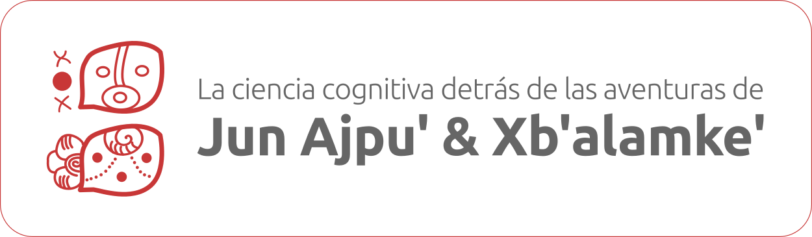

# CogSci-Maya &nbsp; 
- This project aims to spread awareness of cognitive science among educators in Mayan and Mestizo communities using stories from the Popol Wuj. Click here for the [English content](#english-contents--). 
- Este proyecto tiene como objetivo difundir la importancia de las ciencias cognitivas entre educadores de comunidades Mayas y Mestizas utilizando historias del Popol Wuj. Haga clic aquí para ver el [contenido en Español](#contenido-en-espa%C3%B1ol--).

---

# English contents &nbsp; 
## Slides
- Part 1: [Neuroscience](https://github.com/smy1/cogsci-maya/tree/main/slides/en_L1_neuroscience.pdf)
- Part 2: [Cognitive psychology](https://github.com/smy1/cogsci-maya/tree/main/slides/en_L2_cognitive.pdf)
- Part 3: [Comparative psychology](https://github.com/smy1/cogsci-maya/tree/main/slides/en_L3_comparative.pdf)
- Part 4: [Developmental psychology](https://github.com/smy1/cogsci-maya/tree/main/slides/en_L4_developmental.pdf)
## Reading materials
- reading 1: [House of Bats](https://github.com/smy1/cogsci-maya/tree/main/materials/en-reading-1.pdf)
- reading 2: [A test for Xmuqane](https://github.com/smy1/cogsci-maya/tree/main/materials/en-reading-2.pdf)
- reading 3: [Teaming up with a rat](https://github.com/smy1/cogsci-maya/tree/main/materials/en-reading-3.pdf)
- reading 4: [Seven Macaw and his sons](https://github.com/smy1/cogsci-maya/tree/main/materials/en-reading-4.pdf)
## Blogpost in Cognitive Science Society
- 23 February 2025: [Bridging Worlds between Indigenous Communities and Science](https://cognitivesciencesociety.org/bridging-worlds-between-indigenous-communities-and-science-exploring-cognitive-science-through-mayan-tales/)
---

# Contenido en Español &nbsp; 
## Presentaciones
- Introducción: [Introducción al taller](https://docs.google.com/presentation/d/1yqR9ibQvPiqDyQXZk_v_tky9MHfUG8sjImhWA_J0h9o/edit?usp=sharing)
- Parte 1: [Neurociencias](https://docs.google.com/presentation/d/1TjwjvWWxerI_sjYnVBM77RTZtfB4LZkHLC1USfM_Gq8/edit?usp=sharing)
- Parte 2: [Psicología cognitiva](https://docs.google.com/presentation/d/1ed30nF9xbTWrHOfoD3DEW-ntgkK_mveP8AgvrJzQUuw/edit?usp=sharing)
- Parte 3: [Psicología comparativa](https://docs.google.com/presentation/d/1VsI9fg6i6rYT_V6m0SzjlMsDWU4VpkVnCMNBSKwmtk8/edit?usp=sharing)
- Parte 4: [Psicología del desarrollo](https://docs.google.com/presentation/d/1DUCz6HtPPjSXexe-r_AnKTUPz0lg1J8to70N0AYH-zk/edit?usp=sharing)
## Materiales de lectura
- Lectura 1: [La casa de los murciélagos](https://docs.google.com/document/d/1wHdkol2VQ3WzmaIZ3mmsnBqv4cN_b99do0t5HqsyQq0/edit?usp=drive_link)
- Lectura 2: [Una prueba para Xmuqane](https://docs.google.com/document/d/1Z-14K027tJHOR9b6mSqE8FaZaO2Eb7c850d8b_7LFi8/edit?usp=sharing)
- Lectura 3: [Con la ayuda de una rata](https://docs.google.com/document/d/1F76KLbMxoQmi1V7eqWwKv3oRiUPPcoKWUkJjesO3jnw/edit?usp=sharing)
- Lectura 4: [Wuqub’ Kak’ix y sus hijos](https://docs.google.com/document/d/1vix-SS-b60mu5-O3Wuz0c54JxUZBB5OYAFa-7REzNxY/edit?usp=sharing)
## Vídeos
- Tutorial sobre cómo utilizar el experimento en línea: [Vídeo tutorial](https://drive.google.com/file/d/1dQnmFmv_BPvYJAPFag0P8UbDDIVZ5oCL/view?usp=drive_link)
- Sesión 1 del taller en línea: [Sesión 1](https://drive.google.com/file/d/1RwZIjP1G7rr9fW6Dc9LnWzbPhu_juvK3/view?usp=drive_link)
- Sesión 2 del taller en línea: [Sesión 2](https://drive.google.com/file/d/19rCggPp4uLgLhICO_d-NufgWArrKzHtg/view?usp=drive_link)
